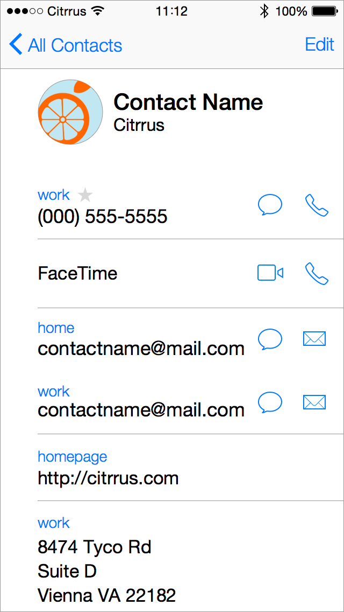
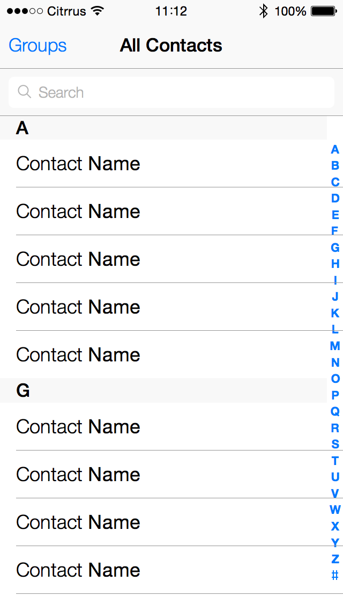
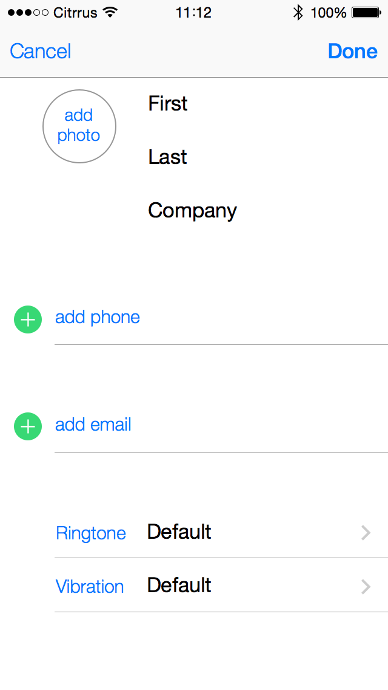
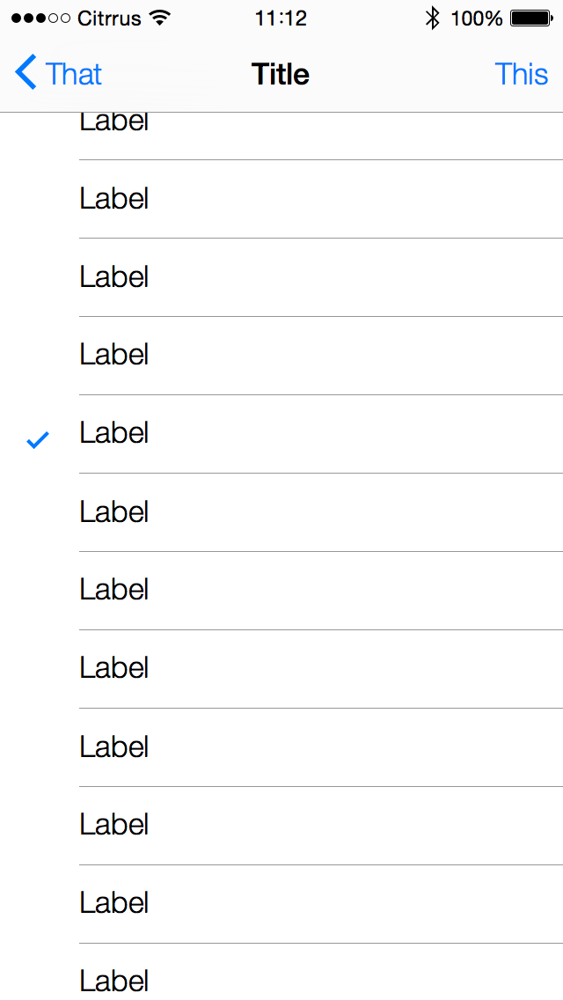
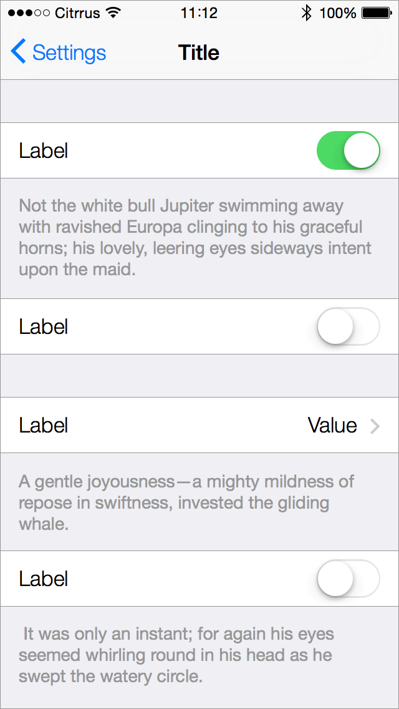
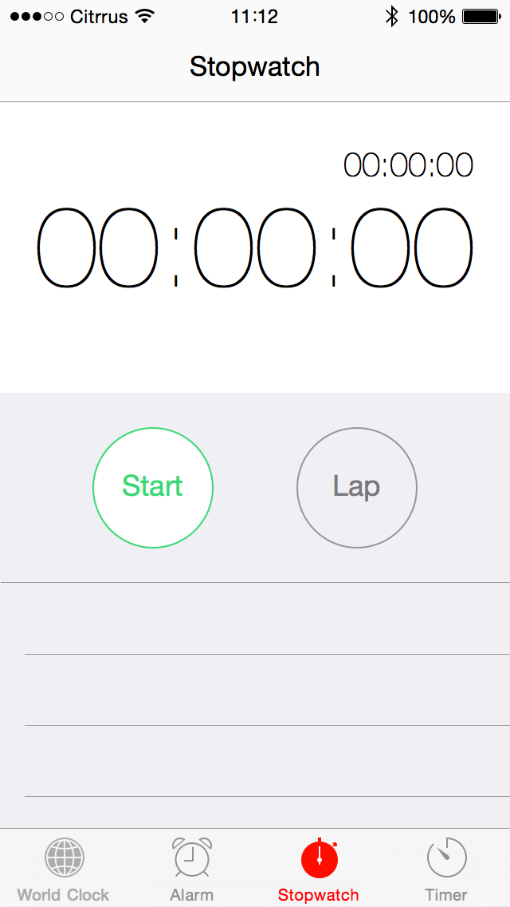

iOS 7 GUI Table Views 
====================
###Sketch template###

*	This template includes native iOS 7 table views that are often used in apps
*	All features/elements are intended to be sized according to default iOS 7 sizes
*	All shape and text layers are editable  
*	Sketch 3 or later is required

Clone, or simply download the _zip file_ to use. 

Enjoy!

